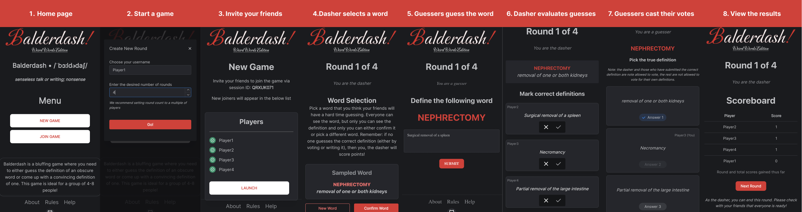

## Overview

This is an unofficial online version of the multiplayer game, Balderdash. This version of the game is exclusive to **weird words** only (a single category)

In this game, you will be given a rare word which you probably would have never heard of, and you'll try to come up with a convincing definition of this word. In the end of the round, you along with other players will vote on which definition is the most convincing. The player with the most votes will get a point. You also get points for guessing the rare word correctly. The player with the most points at the end of the game wins. Note that there are minor differences between this version and the original game as this version is optimized for playing online.

Please note that not a lot of effort went into creating this app, so if you find a bug or have any suggestions or feedback, please feel free to create an issue. You are welcome to submit a PR as well :)

## Screenshots

The below screenshot demonstrates what the game looks like.

## Rules

The game is played in rounds. In the beginning of each round, one of the players is designated as the _dasher_ -- this player will see the word of the round and its definition. The other players will try to come up with a believable definition. Once everyone submits their answers, the dasher will mark words that are close enough to the real definition. Next, players who did not submit the correct definition, will see the true and the made up answers, and they will get to vote for the most believable one. The scores are awarded in the end of each round in the following manner:

* Players guessing the correct definition get 1 point
* Players who did not get the right answer but got a vote receive 1 point for each vote
* The dasher gets 2 points in none of the players guess the right answer

The player with the most points at the end of the game wins.

## Playing the game

* This app is "optimised" (yeah, right) for mobile devices
* You need at least 3 people to play, but ideally you'd play it with 5-7 people.
* One person needs to set up a game, and they will be able to invite other players to join.
* Whoever is setting up a game will choose the number of _cycles_ played. Each cycle consists of as many rounds as there are players. For example, if you have 5 players, and you play for 1 cycle, the game will end after everyone has played as the dasher once.
* The dasher is given the choice to skip a word if they feel that it is not appropriate for whatever reason
* If only 1 or fewer players do not guess the correct answer, the voting stage will be skipped

## About

This app makes use of the following components:
* [The Phrontistery](https://phrontistery.info/ihlstart.html) dictionary of about 17K rare words
* [Firebase](https://firebase.google.com/) backend + hosting
* [NextJS](https://nextjs.org/) frontend
